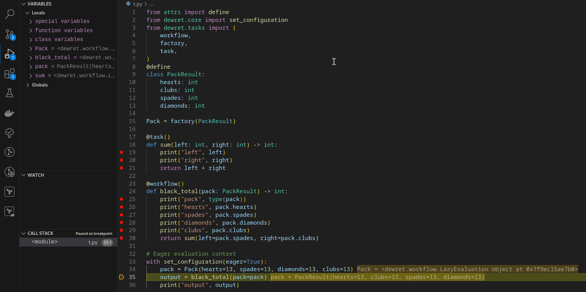

# Debug Task Execution at Render Time

## Description

The `--eager` flag is designed to help users debug tasks and workflows during render time, before the final CWL (or other) workflow is generated.

Normally, dewret builds a lazy task graph that is rendered into a declarative workflow (e.g., CWL, Snakemake). However, this can make debugging difficult, since no code is actually executed during rendering.

With `--eager`, dewret will:

- Directly execute the task using the provided inputs
- Print the result to the terminal
- Bypass the lazy rendering pipeline

This allows you to:
- Test tasks in isolation
- Verify that input arguments are valid
- Inspect real outputs before committing to workflow generation

---

## Usage

When using eager evaluation, dewret will evaluate and execute the workflow **immediately**, rather than generating a declarative workflow. This is useful for debugging and inspecting runtime behavior.

---

### Simple workflow or task

Given the following workflow:

```python
# eager_demo.py
from dewret.tasks import (
    workflow,
    task,
)

@task()
def sum(left: int, right: int) -> int:
    print("left", left)
    print("right", right)
    return left + right

@workflow()
def black_total(
    hearts: int,
    clubs: int,
    spades: int,
    diamonds: int
) -> int:
    print("hearts", hearts)
    print("spades", spades)
    print("diamonds", diamonds)
    print("clubs", clubs)
    return sum(left=spades, right=clubs)
```

Run a single task via CLI:

```bash
python -m dewret --eager eager_demo.py sum "left:10" "right:11"
```

Output:

```text
{'left': 10, 'right': 11}
{'left': <class 'int'>, 'right': <class 'int'>, 'return': <class 'int'>}
left 10
right 11
21
```

Run the full workflow via CLI:

```bash
python -m dewret --eager eager_demo.py black_total "hearts:10" "spades:11" "diamonds:12" "clubs:13"
```

Output:

```text
{'hearts': 10, 'spades': 11, 'diamonds': 12, 'clubs': 13}
{'hearts': <class 'int'>, 'clubs': <class 'int'>, 'spades': <class 'int'>, 'diamonds': <class 'int'>, 'return': <class 'int'>}
hearts 10
spades 11
diamonds 12
clubs 13

{'left': 11, 'right': 13}
{'left': <class 'int'>, 'right': <class 'int'>, 'return': <class 'int'>}
left 11
right 13
24
```

---

### Debugging workflows with custom objects

For more complex cases using factories or dataclasses, use eager evaluation in code like this:

```python
>>> from attrs import define
>>> from dewret.core import set_configuration
>>> from dewret.tasks import workflow, factory, task

>>> @define
... class PackResult:
...     hearts: int
...     clubs: int
...     spades: int
...     diamonds: int

>>> Pack = factory(PackResult)

>>> @task()
... def sum(left: int, right: int) -> int:
...     print("left", left)
...     print("right", right)
...     return left + right

>>> @workflow()
... def black_total(pack: PackResult) -> int:
...     print("pack", type(pack))
...     print("hearts", pack.hearts)
...     print("spades", pack.spades)
...     print("diamonds", pack.diamonds)
...     print("clubs", pack.clubs)
...     return sum(left=pack.spades, right=pack.clubs)

>>> with set_configuration(eager=True):
...     pack = Pack(hearts=13, spades=13, diamonds=13, clubs=13)
...     output = black_total(pack=pack)
...     print("output", output)
pack <class '__main__.PackResult'>
hearts 13
spades 13
diamonds 13
clubs 13
left 13
right 13
output 26

```

## Debugging with eager on VS code


