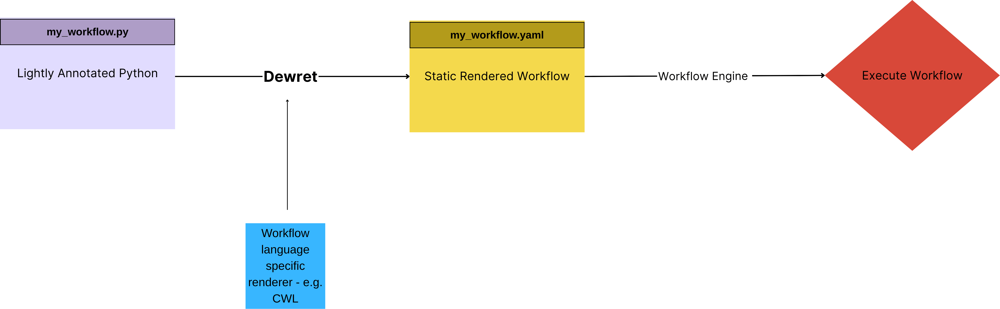
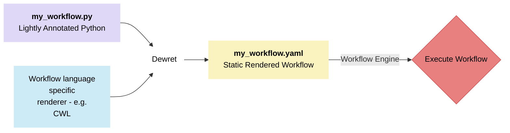

# Quickstart <!-- omit in toc --> 
- [Introduction](#introduction)
  - [Description](#description)
  - [What are Workflows?](#what-are-workflows)
  - [What Makes Dewret Unique? Why should I use Dewret?](#what-makes-dewret-unique-why-should-i-use-dewret)
    - [Advantages of writing workflows in Python with Dewret](#advantages-of-writing-workflows-in-python-with-dewret)
    - [Advantages of producing a static representation of a workflow](#advantages-of-producing-a-static-representation-of-a-workflow)
- [Installation for pure users](#installation-for-pure-users)
  - [From PyPI:](#from-pypi)
  - [From Conda:](#from-conda)
- [Installation for developers](#installation-for-developers)
- [Usage](#usage)
  - [Programmatic Usage](#programmatic-usage)
- [Next Steps](#next-steps)


## Introduction 

### Description 

Dewret is a tool designed for creating complex workflows, written in a dynamic language, to be compiled (transpiled) to a static representation. Dewret provides a programmatic Python interface to multiple declarative workflow engines, where workflows are often written in a yaml-like syntax. Workflow engines can be "plugged"-in by writing a specific [renderer](renderers.md).

<!--  -->
<!-- This diagram was drawn by first getting a version on canva, then using an LLM to get some code, and then tweaking it, it doesn't display well on markdown preview on vscode but it displays well on github -->

 Currently, Dewret supports two renderers: [Snakemake] and [CWL], which generate yamls in the corresponding workflow languages.


[Snakemake]: https://snakemake.readthedocs.io/en/stable/
[CWL]: https://www.commonwl.org/

### What are Workflows?

Workflows are a collection of tasks or steps designed to automate complex processes. These processes are common in fields like data science, scientific computing and software development, where you can ensure automation. Traditionally, managing workflows can be challenging due to the diversity of backend systems and the complexity of configurations involved.

### What Makes Dewret Unique? Why should I use Dewret?

Dewret lets you have your cake and eat it too, by providing you with the benefits of programming in a dynamic language and having the reliability of a modern workflow engine.

#### Advantages of writing workflows in Python with Dewret

- **Type Checking**: by using lightly annotated Python one can catch mistakes very easily
- **IDE Integration**: Syntax highlighting, code completion, etc.
- **Continuous Integration and Testing**: complex dynamic workflows can be rapidly sense-checked in CI without needing all the hardware and internal algorithms present to run them.
- **Rapid Prototyping**: Can prototype and run code [locally](eager_execution.md).
- **Consistency**: offers a consistent interface for defining tasks and workflows.
- **Conciseness**: yaml tends to be much more verbose than Python which increases cognitive load.
- **Customization**: dewret offers the ability to create custom renderers for workflows in desired languages. This includes default support for CWL and Snakemake workflow languages. The capability to render a single workflow into multiple declarative languages enables users to experiment with different workflow engines.
- **Built-in Renderers**: Snakemake and CWL.

#### Advantages of producing a static representation of a workflow

- **Reproducibility and Portability**: workflows are declarative, explicitly defining inputs, outputs, and dependencies, which ensures that workflows can be reproduced accurately across different environments
- **Optimization**: creating a declarative workflow opens up possibilities for static analysis and refactoring before execution.
- **Version controlled execution**: while code can be versioned, changes in a dynamic workflow may not clearly correspond to changes in the executed workflow. By defining a static workflow that is rendered from the dynamic or programmatic workflow, we maintain a precise and trackable history.
- **Debugging**: a number of classes of workflow planning bugs will not appear until late in a simulation run that might take days or weeks. Having a declarative and static workflow definition document post-render provides enhanced possibilities for static analysis, helping to catch these issues before startup.

## Installation for pure users

If you simply want to use Dewret to run workflows, you can install it from PyPI or Conda.

### From PyPI:
```shell
pip install dewret
```

### From Conda:
```shell
conda install conda-forge::dewret
```

## Installation for developers

From a cloned repository:

    pip install -e .

## Usage

You can render a simple Common Workflow Language [CWL](https://www.commonwl.org/) workflow from a graph composed of one or more tasks as follows:

```python
# workflow.py

from dewret.tasks import task

@task()
def increment(num: int) -> int:
    return num + 1
```

```sh
$ python -m dewret --pretty workflow.py increment num:3
```

```yaml
class: Workflow
cwlVersion: v1.2
outputs:
  out:
    outputSource: increment-e138626779553199eb2bd678356b640f-num
    type: int
steps:
  increment-e138626779553199eb2bd678356b640f-num
    in:
      num:
        default: 3
    out:
    - out
    run: increment
```

By default `dewret` uses a [dask](https://www.dask.org/) backend so that `dewret.task` wraps a `dask.delayed`, and renders a CWL workflow. 


### Programmatic Usage

Building and rendering may be done programmatically,
which provides the opportunity to use custom renderers
and backends, as well as bespoke serialization or formatting.

```python
>>> import sys
>>> import yaml
>>> from dewret.tasks import task, construct
>>> from dewret.renderers.cwl import render
>>> 
>>> @task()
... def increment(num: int) -> int:
...     return num + 1
>>>
>>> result = increment(num=3)
>>> workflow = construct(result, simplify_ids=True)
>>> cwl = render(workflow)["__root__"]
>>> yaml.dump(cwl, sys.stdout, indent=2)
class: Workflow
cwlVersion: v1.2
inputs:
  increment-1-num:
    default: 3
    label: num
    type: int
outputs:
  out:
    label: out
    outputSource: increment-1/out
    type: int
steps:
  increment-1:
    in:
      num:
        source: increment-1-num
    out:
    - out
    run: increment

```

## Next Steps

* Renderer Resources
  * Writing your own [renderer](renderer_tutorial.md)
  * [Available renderers](available_renderers.md)
* [Eager execution](eager_execution.md)
* Writing a [workflow](writing_a_workflow.md)
* [Glossary](glossary.md)