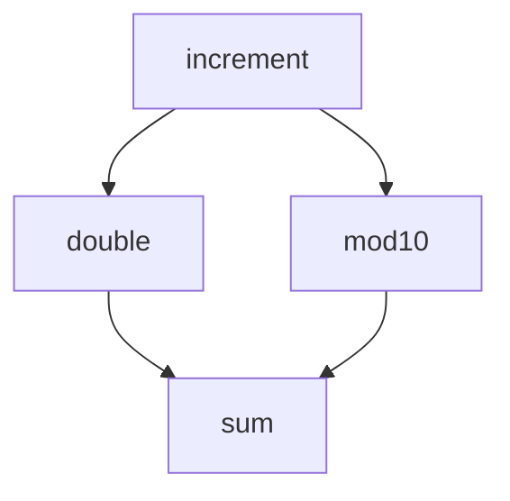

# Workflows

## Setup

We can pull in dewret tools to produce CWL with a small number of imports.

```python
>>> import sys
>>> import yaml
>>> from dewret.tasks import task, run
>>> from dewret.renderers.cwl import render

```

## Dependencies

Specifying step interdependencies is possible by combining lazy-evaluated function
calls.

Dewret hashes the parameters to identify and unify steps. This lets you do, for example:



In code, this would be:

```python
>>> @task()
... def increment(num: int) -> int:
...     """Increment an integer."""
...     return num + 1
>>> 
>>> @task()
... def double(num: int) -> int:
...     """Double an integer."""
...     return 2 * num
>>> 
>>> @task()
... def mod10(num: int) -> int:
...     """Take num mod 10."""
...     return num % 10
>>> 
>>> @task()
... def sum(left: int, right: int) -> int:
...     """Add two integers."""
...     return left + right
>>>
>>> result = sum(
...     left=double(num=increment(num=23)),
...     right=mod10(num=increment(num=23))
... )
>>> workflow = run(result, simplify_ids=True)
>>> cwl = render(workflow)
>>> yaml.dump(cwl, sys.stdout, indent=2)
class: Workflow
cwlVersion: 1.2
inputs: {}
outputs:
  out:
    label: out
    outputSource: sum-1/out
    type: int
steps:
  double-1:
    in:
      num:
        source: increment-1/out
    out:
    - out
    run: double
  increment-1:
    in:
      num:
        default: 23
    out:
    - out
    run: increment
  mod10-1:
    in:
      num:
        source: increment-1/out
    out:
    - out
    run: mod10
  sum-1:
    in:
      left:
        source: double-1/out
      right:
        source: mod10-1/out
    out:
    - out
    run: sum

```

## Parameters

The tool will spot global variables that you have used when building your tasks,
and treat them as parameters. It will try to get the type from the typehint, or
the value that you have set it to. This only works for basic types (and dict/lists of
those).

For example:
```python
>>> INPUT_NUM = 3
>>> @task()
... def rotate(num: int) -> int:
...    """Rotate an integer."""
...    return (num + INPUT_NUM) % INPUT_NUM
>>>
>>> result = rotate(num=3)
>>> workflow = run(result, simplify_ids=True)
>>> cwl = render(workflow)
>>> yaml.dump(cwl, sys.stdout, indent=2)
class: Workflow
cwlVersion: 1.2
inputs:
  INPUT_NUM:
    label: INPUT_NUM
    type: int
outputs:
  out:
    label: out
    outputSource: rotate-1/out
    type: int
steps:
  rotate-1:
    in:
      INPUT_NUM:
        source: INPUT_NUM
      num:
        default: 3
    out:
    - out
    run: rotate

```

## Nested tasks

When you wish to combine tasks together programmatically,
you can use nested tasks. These are run at _render_ time, not
execution time. In other words, they do not appear in the
final graph, and so must only combine other tasks.

Note that, as with all dewret calculations, only the steps
necessary to achieve the ultimate output are included in the final
graph. Therefore, nested tasks must return a step execution
(task that is being called) that forces any other calculations
you wish to happen. __In other words, if an task in a
nested task does not have an impact on the return value,
it will disappear__.

For example:
```python
>>> from dewret.tasks import nested_task
>>> @nested_task()
... def double_rotate(num: int) -> int:
...    """Rotate an integer twice."""
...    return rotate(num=rotate(num=num))
>>>
>>> result = double_rotate(num=3)
>>> workflow = run(result, simplify_ids=True)
>>> cwl = render(workflow)
>>> yaml.dump(cwl, sys.stdout, indent=2)
class: Workflow
cwlVersion: 1.2
inputs:
  INPUT_NUM:
    label: INPUT_NUM
    type: int
outputs:
  out:
    label: out
    outputSource: rotate-2/out
    type: int
steps:
  rotate-1:
    in:
      INPUT_NUM:
        source: INPUT_NUM
      num:
        default: 3
    out:
    - out
    run: rotate
  rotate-2:
    in:
      INPUT_NUM:
        source: INPUT_NUM
      num:
        source: rotate-1/out
    out:
    - out
    run: rotate

```

## Step Output Fields

Each step, by default, is treated as having
a single result. However, we allow a mechanism
for specifying multiple fields, using `attrs`.

Where needed, fields can be accessed outside of tasks
by dot notation and dewret will map that access to a
specific output field in CWL.

Note that in the example below, `shuffle` is still
only seen once in the graph:

```python
>>> from attrs import define
>>> from numpy import random
>>> from dewret.tasks import nested_task
>>> @define
... class PackResult:
...     hearts: int
...     clubs: int
...     spades: int
...     diamonds: int
>>>
>>> @task()
... def shuffle(max_cards_per_suit: int) -> PackResult:
...    """Fill a random pile from a card deck, suit by suit."""
...    return PackResult(
...        hearts=random.randint(max_cards_per_suit),
...        clubs=random.randint(max_cards_per_suit),
...        spades=random.randint(max_cards_per_suit),
...        diamonds=random.randint(max_cards_per_suit)
...    )
>>> @task()
... def sum(left: int, right: int) -> int:
...    return left + right
>>> red_total = sum(
...     left=shuffle(max_cards_per_suit=13).hearts,
...     right=shuffle(max_cards_per_suit=13).diamonds
... )
>>> workflow = run(red_total, simplify_ids=True)
>>> cwl = render(workflow)
>>> yaml.dump(cwl, sys.stdout, indent=2)
class: Workflow
cwlVersion: 1.2
inputs: {}
outputs:
  out:
    label: out
    outputSource: sum-1/out
    type: int
steps:
  shuffle-1:
    in:
      max_cards_per_suit:
        default: 13
    out:
      clubs:
        label: clubs
        type: int
      diamonds:
        label: diamonds
        type: int
      hearts:
        label: hearts
        type: int
      spades:
        label: spades
        type: int
    run: shuffle
  sum-1:
    in:
      left:
        source: shuffle-1/hearts
      right:
        source: shuffle-1/diamonds
    out:
    - out
    run: sum

```
