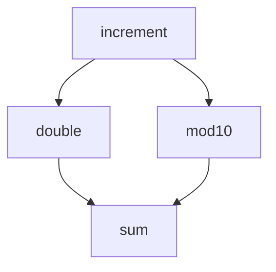

# Workflows

## Dependencies

Specifying step interdependencies is possible by combining lazy-evaluated function
calls.

Dewret hashes the parameters to identify and unify steps. This lets you do, for example:



In code, this would be:

```python
>>> import sys
>>> import yaml
>>> from dewret.tasks import task, run
>>> from dewret.renderers.cwl import render
>>> 
>>> @task()
... def increment(num: int) -> int:
...     """Increment an integer."""
...     return num + 1
>>> 
>>> @task()
... def double(num: int) -> int:
...     """Double an integer."""
...     return 2 * num
>>> 
>>> @task()
... def mod10(num: int) -> int:
...     """Double an integer."""
...     return num % 10
>>> 
>>> @task()
... def sum(left: int, right: int) -> int:
...     """Add two integers."""
...     return left + right
>>>
>>> result = sum(
...     left=double(num=increment(num=23)),
...     right=mod10(num=increment(num=23))
... )
>>> workflow = run(result, simplify_ids=True)
>>> cwl = render(workflow)
>>> yaml.dump(cwl, sys.stdout, indent=2)
class: Workflow
cwlVersion: 1.2
steps:
  double-1:
    in:
      num:
        source: increment-1/out
    out:
    - out
    run: double
  increment-1:
    in:
      num:
        default: 23
    out:
    - out
    run: increment
  mod10-1:
    in:
      num:
        source: increment-1/out
    out:
    - out
    run: mod10
  sum-1:
    in:
      left:
        source: double-1/out
      right:
        source: mod10-1/out
    out:
    - out
    run: sum

```
