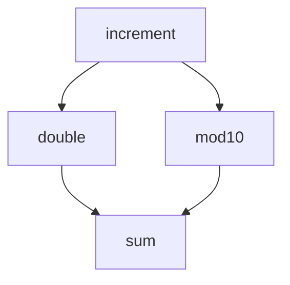
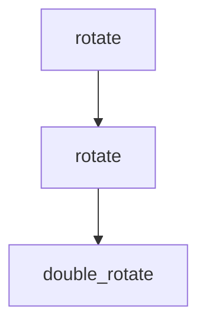
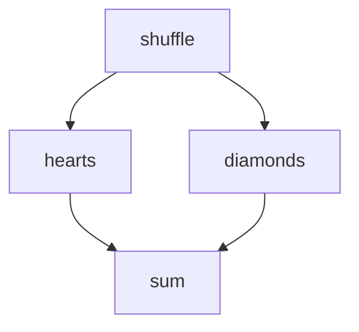

# Workflows

## Description

A dewret workflow is composed of one or more steps that may make use of both local and global parameters. Each step is defined by a dewret task that is created by using the @task() decorator, and each task may be used by multiple steps.

## Setup

We can pull in dewret tools to produce CWL with a small number of imports.

```python
>>> import sys
>>> import yaml
>>> from dewret.tasks import task, construct
>>> from dewret.workflow import param
>>> from dewret.renderers.cwl import render

```

## Dependencies

Specifying step interdependencies is possible by combining lazy-evaluated function
calls. The output series of steps is not guaranteed to be in order of execution.

Dewret hashes the parameters to identify and unify steps. This lets you do, for example:



In code, this would be:

```python
>>> import sys
>>> import yaml
>>> from dewret.tasks import task, construct
>>> from dewret.renderers.cwl import render
>>> @task()
... def increment(num: int) -> int:
...     """Increment an integer."""
...     return num + 1
>>> 
>>> @task()
... def double(num: int) -> int:
...     """Double an integer."""
...     return 2 * num
>>> 
>>> @task()
... def mod10(num: int) -> int:
...     """Take num mod 10."""
...     return num % 10
>>> 
>>> @task()
... def sum(left: int, right: int) -> int:
...     """Add two integers."""
...     return left + right
>>>
>>> result = sum(
...     left=double(num=increment(num=23)),
...     right=mod10(num=increment(num=23))
... )
>>> wkflw = construct(result, simplify_ids=True)
>>> cwl = render(wkflw)["__root__"]
>>> yaml.dump(cwl, sys.stdout, indent=2)
class: Workflow
cwlVersion: 1.2
inputs:
  increment-1-num:
    default: 23
    label: num
    type: int
outputs:
  out:
    label: out
    outputSource: sum-1/out
    type: int
steps:
  double-1:
    in:
      num:
        source: increment-1/out
    out:
    - out
    run: double
  increment-1:
    in:
      num:
        source: increment-1-num
    out:
    - out
    run: increment
  mod10-1:
    in:
      num:
        source: increment-1/out
    out:
    - out
    run: mod10
  sum-1:
    in:
      left:
        source: double-1/out
      right:
        source: mod10-1/out
    out:
    - out
    run: sum

```

Notice that the `increment` tasks appears twice in the CWL workflow definition, being referenced twice in the python code above. 
This duplication can be avoided by explicitly indicating that the parameters are the same, with the `param` function.

```python
>>> import sys
>>> import yaml
>>> from dewret.workflow import param
>>> from dewret.tasks import task, construct
>>> from dewret.renderers.cwl import render
>>> @task()
... def increment(num: int) -> int:
...     """Increment an integer."""
...     return num + 1
>>> 
>>> @task()
... def double(num: int) -> int:
...     """Double an integer."""
...     return 2 * num
>>> 
>>> @task()
... def mod10(num: int) -> int:
...     """Take num mod 10."""
...     return num % 10
>>> 
>>> @task()
... def sum(left: int, right: int) -> int:
...     """Add two integers."""
...     return left + right
>>>
>>> num = param("num", default=3)
>>> result = sum(
...     left=double(num=increment(num=num)),
...     right=mod10(num=increment(num=num))
... )
>>> wkflw = construct(result, simplify_ids=True)
>>> cwl = render(wkflw)["__root__"]
>>> yaml.dump(cwl, sys.stdout, indent=2)
class: Workflow
cwlVersion: 1.2
inputs:
  num:
    default: 3
    label: num
    type: int
outputs:
  out:
    label: out
    outputSource: sum-1/out
    type: int
steps:
  double-1:
    in:
      num:
        source: increment-1/out
    out:
    - out
    run: double
  increment-1:
    in:
      num:
        source: num
    out:
    - out
    run: increment
  mod10-1:
    in:
      num:
        source: increment-1/out
    out:
    - out
    run: mod10
  sum-1:
    in:
      left:
        source: double-1/out
      right:
        source: mod10-1/out
    out:
    - out
    run: sum

```

## Parameters

The tool will spot global variables that you have used when building your tasks,
and treat them as parameters. It will try to get the type from the typehint, or
the value that you have set it to. This only works for basic types (and dict/lists of
those).

While global variables are implicit input to the Python function **note that**:

1. in CWL, they will be rendered as explicit global input to a step
2. as input, they are read-only, and must not be updated

For example:
```python
>>> import sys
>>> import yaml
>>> from dewret.workflow import param
>>> from dewret.tasks import task, construct
>>> from dewret.renderers.cwl import render
>>> INPUT_NUM = 3
>>> @task()
... def rotate(num: int) -> int:
...    """Rotate an integer."""
...    return (num + INPUT_NUM) % INPUT_NUM
>>>
>>> result = rotate(num=5)
>>> wkflw = construct(result, simplify_ids=True)
>>> cwl = render(wkflw)["__root__"]
>>> yaml.dump(cwl, sys.stdout, indent=2)
class: Workflow
cwlVersion: 1.2
inputs:
  INPUT_NUM:
    default: 3
    label: INPUT_NUM
    type: int
  rotate-1-num:
    default: 5
    label: num
    type: int
outputs:
  out:
    label: out
    outputSource: rotate-1/out
    type: int
steps:
  rotate-1:
    in:
      INPUT_NUM:
        source: INPUT_NUM
      num:
        source: rotate-1-num
    out:
    - out
    run: rotate

```

## Nested tasks

When you wish to combine tasks together programmatically,
you can use nested tasks. These are run at _render_ time, not
execution time. In other words, they do not appear in the
final graph, and so must only combine other tasks.

For example:



As code:

```python
>>> import sys
>>> import yaml
>>> from dewret.core import set_configuration
>>> from dewret.tasks import task, construct, workflow
>>> from dewret.renderers.cwl import render
>>> INPUT_NUM = 3
>>> @task()
... def rotate(num: int) -> int:
...     """Rotate an integer."""
...     return (num + INPUT_NUM) % INPUT_NUM
>>>
>>> @workflow()
... def double_rotate(num: int) -> int:
...     """Rotate an integer twice."""
...     return rotate(num=rotate(num=num))
>>>
>>> with set_configuration(flatten_all_nested=True):
...     result = double_rotate(num=3)
...     wkflw = construct(result, simplify_ids=True)
...     cwl = render(wkflw)["__root__"]
>>> yaml.dump(cwl, sys.stdout, indent=2)
class: Workflow
cwlVersion: 1.2
inputs:
  INPUT_NUM:
    default: 3
    label: INPUT_NUM
    type: int
  num:
    default: 3
    label: num
    type: int
outputs:
  out:
    label: out
    outputSource: rotate-1/out
    type: int
steps:
  rotate-1:
    in:
      INPUT_NUM:
        source: INPUT_NUM
      num:
        source: rotate-2/out
    out:
    - out
    run: rotate
  rotate-2:
    in:
      INPUT_NUM:
        source: INPUT_NUM
      num:
        source: num
    out:
    - out
    run: rotate

```
Note that, as with all dewret calculations, only the steps
necessary to achieve the ultimate output are included in the final
graph. Therefore, nested tasks must return a step execution
(task that is being called) that forces any other calculations
you wish to happen. __In other words, if a task in a
nested task does not have an impact on the return value,
it will disappear__.
For example, the following code renders the same workflow as in the previous example:


```python
@workflow()
def double_rotate(num: int) -> int:
   """Rotate an integer twice."""
   unused_var = increment(num=num)
   return rotate(num=rotate(num=num))
```

## Step Output Fields

Each step, by default, is treated as having
a single result. However, we allow a mechanism
for specifying multiple fields, using `attrs` or `dataclasses`.

Where needed, fields can be accessed outside of tasks
by dot notation and dewret will map that access to a
specific output field in CWL.

Note that in the example below, `shuffle` is still
only seen once in the graph:



As code:

```python
>>> import sys
>>> import yaml
>>> from attrs import define
>>> from numpy import random
>>> from dewret.tasks import task, construct
>>> from dewret.renderers.cwl import render
>>> @define
... class PackResult:
...     hearts: int
...     clubs: int
...     spades: int
...     diamonds: int
>>>
>>> @task()
... def shuffle(max_cards_per_suit: int) -> PackResult:
...    """Fill a random pile from a card deck, suit by suit."""
...    return PackResult(
...        hearts=random.randint(max_cards_per_suit),
...        clubs=random.randint(max_cards_per_suit),
...        spades=random.randint(max_cards_per_suit),
...        diamonds=random.randint(max_cards_per_suit)
...    )
>>> @task()
... def sum(left: int, right: int) -> int:
...    return left + right
>>> red_total = sum(
...     left=shuffle(max_cards_per_suit=13).hearts,
...     right=shuffle(max_cards_per_suit=13).diamonds
... )
>>> wkflw = construct(red_total, simplify_ids=True)
>>> cwl = render(wkflw)["__root__"]
>>> yaml.dump(cwl, sys.stdout, indent=2)
class: Workflow
cwlVersion: 1.2
inputs:
  shuffle-1-max_cards_per_suit:
    default: 13
    label: max_cards_per_suit
    type: int
outputs:
  out:
    label: out
    outputSource: sum-1/out
    type: int
steps:
  shuffle-1:
    in:
      max_cards_per_suit:
        source: shuffle-1-max_cards_per_suit
    out:
      clubs:
        label: clubs
        type: int
      diamonds:
        label: diamonds
        type: int
      hearts:
        label: hearts
        type: int
      spades:
        label: spades
        type: int
    run: shuffle
  sum-1:
    in:
      left:
        source: shuffle-1/hearts
      right:
        source: shuffle-1/diamonds
    out:
    - out
    run: sum

```

Here, we show the same example with `dataclasses`.

```python 
>>> import sys
>>> import yaml
>>> from dataclasses import dataclass
>>> from numpy import random
>>> from dewret.tasks import task, construct
>>> from dewret.renderers.cwl import render
>>> @dataclass
... class PackResult:
...     hearts: int
...     clubs: int
...     spades: int
...     diamonds: int
>>>
>>> @task()
... def shuffle(max_cards_per_suit: int) -> PackResult:
...    """Fill a random pile from a card deck, suit by suit."""
...    return PackResult(
...        hearts=random.randint(max_cards_per_suit),
...        clubs=random.randint(max_cards_per_suit),
...        spades=random.randint(max_cards_per_suit),
...        diamonds=random.randint(max_cards_per_suit)
...    )
>>> @task()
... def sum(left: int, right: int) -> int:
...    return left + right
>>>
>>> red_total = sum(
...     left=shuffle(max_cards_per_suit=13).hearts,
...     right=shuffle(max_cards_per_suit=13).diamonds
... )
>>> wkflw = construct(red_total, simplify_ids=True)
>>> cwl = render(wkflw)["__root__"]
>>> yaml.dump(cwl, sys.stdout, indent=2)
class: Workflow
cwlVersion: 1.2
inputs:
  shuffle-1-max_cards_per_suit:
    default: 13
    label: max_cards_per_suit
    type: int
outputs:
  out:
    label: out
    outputSource: sum-1/out
    type: int
steps:
  shuffle-1:
    in:
      max_cards_per_suit:
        source: shuffle-1-max_cards_per_suit
    out:
      clubs:
        label: clubs
        type: int
      diamonds:
        label: diamonds
        type: int
      hearts:
        label: hearts
        type: int
      spades:
        label: spades
        type: int
    run: shuffle
  sum-1:
    in:
      left:
        source: shuffle-1/hearts
      right:
        source: shuffle-1/diamonds
    out:
    - out
    run: sum

```

## Subworkflow

A special form of nested task is available to help divide up
more complex workflows: the *subworkflow*. By wrapping logic in subflows,
dewret will produce multiple output workflows that reference each other.

```python
>>> import sys
>>> import yaml
>>> from attrs import define
>>> from numpy import random
>>> from dewret.tasks import task, construct, workflow
>>> from dewret.renderers.cwl import render
>>> @define
... class PackResult:
...     hearts: int
...     clubs: int
...     spades: int
...     diamonds: int
>>>
>>> @task()
... def sum(left: int, right: int) -> int:
...    return left + right
>>>
>>> @task()
... def shuffle(max_cards_per_suit: int) -> PackResult:
...    """Fill a random pile from a card deck, suit by suit."""
...    return PackResult(
...        hearts=random.randint(max_cards_per_suit),
...        clubs=random.randint(max_cards_per_suit),
...        spades=random.randint(max_cards_per_suit),
...        diamonds=random.randint(max_cards_per_suit)
...    )
>>> @workflow()
... def red_total() -> int:
...     return sum(
...         left=shuffle(max_cards_per_suit=13).hearts,
...         right=shuffle(max_cards_per_suit=13).diamonds
...     )
>>> @workflow()
... def black_total() -> int:
...     return sum(
...         left=shuffle(max_cards_per_suit=13).spades,
...         right=shuffle(max_cards_per_suit=13).clubs
...     )
>>> total = sum(left=red_total(), right=black_total())
>>> wkflw = construct(total, simplify_ids=True)
>>> cwl = render(wkflw)["__root__"]
>>> yaml.dump(cwl, sys.stdout, indent=2)
class: Workflow
cwlVersion: 1.2
inputs: {}
outputs:
  out:
    label: out
    outputSource: sum-1/out
    type: int
steps:
  black_total-1:
    in: {}
    out:
    - out
    run: black_total
  red_total-1:
    in: {}
    out:
    - out
    run: red_total
  sum-1:
    in:
      left:
        source: red_total-1/out
      right:
        source: black_total-1/out
    out:
    - out
    run: sum

```

As we have used subworkflow to wrap the colour totals, the outer workflow
contains references to them only. The subworkflows are now returned by `render`
as a second term.

```python
>>> import sys
>>> import yaml
>>> from attrs import define
>>> from numpy import random
>>> from dewret.tasks import task, construct, workflow
>>> from dewret.renderers.cwl import render
>>> @define
... class PackResult:
...     hearts: int
...     clubs: int
...     spades: int
...     diamonds: int
>>>
>>> @task()
... def shuffle(max_cards_per_suit: int) -> PackResult:
...    """Fill a random pile from a card deck, suit by suit."""
...    return PackResult(
...        hearts=random.randint(max_cards_per_suit),
...        clubs=random.randint(max_cards_per_suit),
...        spades=random.randint(max_cards_per_suit),
...        diamonds=random.randint(max_cards_per_suit)
...    )
>>> @task()
... def sum(left: int, right: int) -> int:
...    return left + right
>>>
>>> @workflow()
... def red_total() -> int:
...     return sum(
...         left=shuffle(max_cards_per_suit=13).hearts,
...         right=shuffle(max_cards_per_suit=13).diamonds
...     )
>>> @workflow()
... def black_total() -> int:
...     return sum(
...         left=shuffle(max_cards_per_suit=13).spades,
...         right=shuffle(max_cards_per_suit=13).clubs
...     )
>>> total = sum(left=red_total(), right=black_total())
>>> wkflw = construct(total, simplify_ids=True)
>>> cwl = render(wkflw)
>>> yaml.dump(cwl["red_total-1"], sys.stdout, indent=2)
class: Workflow
cwlVersion: 1.2
inputs: {}
outputs:
  out:
    label: out
    outputSource: sum-1-1/out
    type: int
steps:
  shuffle-1-1:
    in:
      max_cards_per_suit:
        default: 13
    out:
      clubs:
        label: clubs
        type: int
      diamonds:
        label: diamonds
        type: int
      hearts:
        label: hearts
        type: int
      spades:
        label: spades
        type: int
    run: shuffle
  sum-1-1:
    in:
      left:
        source: shuffle-1-1/hearts
      right:
        source: shuffle-1-1/diamonds
    out:
    - out
    run: sum

```

## Input Factories

Sometimes we want to take complex Python input, not just raw types.
Not all serialization support this, but the `factory` function lets us
wrap a simple call, usually a constructor, that takes _only_ raw arguments.
This can then rendered as either a step or a parameter depending on whether
the chosen renderer has the capability.

Below is the default output, treating `Pack` as a task.

```python
>>> import sys
>>> import yaml
>>> from dewret.tasks import workflow, factory, workflow, construct, task
>>> from attrs import define
>>> from dewret.renderers.cwl import render
>>> @define
... class PackResult:
...     hearts: int
...     clubs: int
...     spades: int
...     diamonds: int
>>>
>>> Pack = factory(PackResult)
>>>
>>> @task()
... def sum(left: int, right: int) -> int:
...    return left + right
>>>
>>> @workflow()
... def black_total(pack: PackResult) -> int:
...     return sum(
...         left=pack.spades,
...         right=pack.clubs
...     )
>>> pack = Pack(hearts=13, spades=13, diamonds=13, clubs=13)
>>> wkflw = construct(black_total(pack=pack), simplify_ids=True)
>>> cwl = render(wkflw)["__root__"]
>>> yaml.dump(cwl, sys.stdout, indent=2)
class: Workflow
cwlVersion: 1.2
inputs:
  PackResult-1-clubs:
    default: 13
    label: clubs
    type: int
  PackResult-1-diamonds:
    default: 13
    label: diamonds
    type: int
  PackResult-1-hearts:
    default: 13
    label: hearts
    type: int
  PackResult-1-spades:
    default: 13
    label: spades
    type: int
outputs:
  out:
    label: out
    outputSource: black_total-1/out
    type: int
steps:
  PackResult-1:
    in:
      clubs:
        source: PackResult-1-clubs
      diamonds:
        source: PackResult-1-diamonds
      hearts:
        source: PackResult-1-hearts
      spades:
        source: PackResult-1-spades
    out:
      clubs:
        label: clubs
        type: int
      diamonds:
        label: diamonds
        type: int
      hearts:
        label: hearts
        type: int
      spades:
        label: spades
        type: int
    run: PackResult
  black_total-1:
    in:
      pack:
        source: PackResult-1/out
    out:
    - out
    run: black_total

```

The CWL renderer is also able to treat `pack` as a parameter, if complex
types are allowed.

```python
>>> import sys
>>> import yaml
>>> from dewret.tasks import task, factory, workflow, construct
>>> from attrs import define
>>> from dewret.renderers.cwl import render
>>> @define
... class PackResult:
...     hearts: int
...     clubs: int
...     spades: int
...     diamonds: int
>>>
>>> Pack = factory(PackResult)
>>> @task()
... def sum(left: int, right: int) -> int:
...    return left + right
>>>
>>> @workflow()
... def black_total(pack: PackResult) -> int:
...     return sum(
...         left=pack.spades,
...         right=pack.clubs
...     )
>>> pack = Pack(hearts=13, spades=13, diamonds=13, clubs=13)
>>> wkflw = construct(black_total(pack=pack), simplify_ids=True)
>>> cwl = render(wkflw, allow_complex_types=True, factories_as_params=True)["black_total-1"]
>>> yaml.dump(cwl, sys.stdout, indent=2)
class: Workflow
cwlVersion: 1.2
inputs:
  pack:
    label: pack
    type: record
outputs:
  out:
    label: out
    outputSource: sum-1-1/out
    type: int
steps:
  sum-1-1:
    in:
      left:
        source: pack/spades
      right:
        source: pack/clubs
    out:
    - out
    run: sum

```
